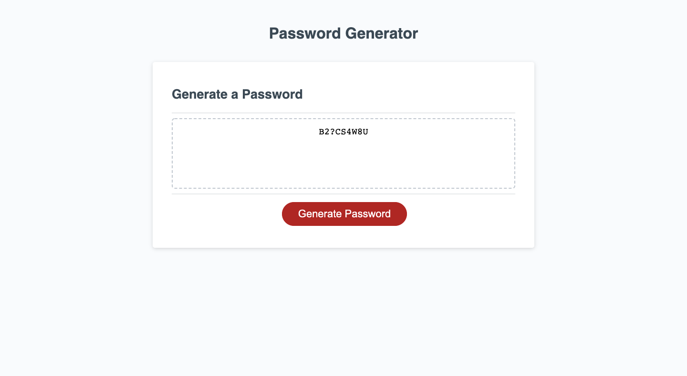

# password-generator-

This is week three's homework assignment. The project consists of creating a password generator with Javascript. Required criteria are that the user be prompted with a series of questions regarding the password's length and character type. Once the prompts are answered a password displaying the user's input accurately displays on the the page. 

URL: https://ktmac21.github.io/password-generator-/

